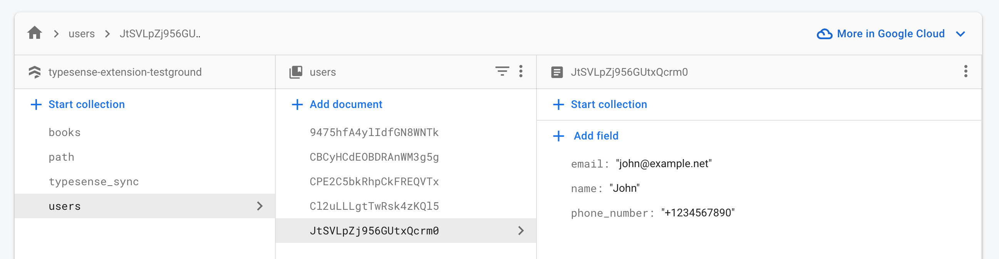
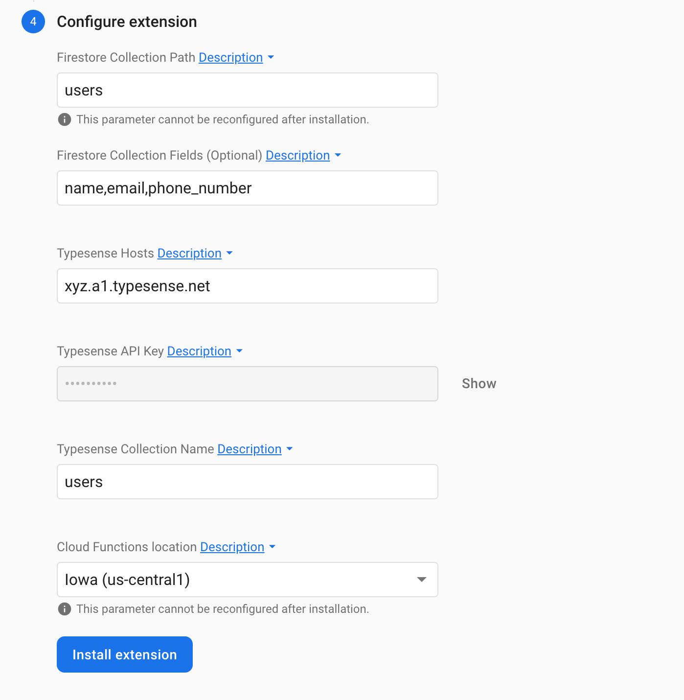

# Firestore / Firebase Typesense Search Extension ⚡ 🔍 

[](https://circleci.com/gh/typesense/firestore-typesense-search)

A Firebase extension to sync data from your Firestore collection to [Typesense](https://typesense.org/), 
to be able to do full-text fuzzy search on your Firestore data, with typo tolerance, faceting, filtering, sorting, curation, synonyms, geosearch and more.

This extension listens to your specified Firestore collection and syncs Firestore documents to Typesense 
on creation, updates and deletes. It also provides a function to help you backfill data.

**What is Typesense?**

If you're new to [Typesense](https://typesense.org), it is an open source search engine that is simple to use, run and scale, with clean APIs and documentation. Think of it as an open source alternative to Algolia and an easier-to-use, batteries-included alternative to ElasticSearch. Get a quick overview from [this guide](https://typesense.org/docs/guide).


## ⚙️ Usage

### Step 1️⃣ : Setup Prerequisites

Before installing this extension, make sure that you have:

1. [Set up a Cloud Firestore database](https://firebase.google.com/docs/firestore/quickstart) in your Firebase project.
2. [Set up](https://typesense.org/docs/guide/install-typesense.html) a Typesense cluster on [Typesense Cloud](https://cloud.typesense.org) or [Self-Hosted](https://typesense.org/docs/guide/install-typesense.html#option-2-local-machine-self-hosting) (free).
3. Set up a Typesense Collection either through the Typesense Cloud dashboard or 
  through the [API](https://typesense.org/docs/latest/api/collections.html#create-a-collection).
  
⚠️ ☝️ #3 above is a commonly missed step. This extension **does not create the Typesense Collection for you**. Instead it syncs data to a Typesense collection you've already created. If you see an HTTP 404 in the extension logs, it's most likely because of missing this step. 

### Step 2️⃣ : Install the Extension 

You can install this extension either through the Firebase Web console or through the Firebase CLI.

##### Firebase Console

[][install-link]

[install-link]: https://console.firebase.google.com/project/_/extensions/install?ref=typesense/firestore-typesense-search

##### Firebase CLI

```bash
firebase ext:install typesense/firestore-typesense-search --project=[your-project-id]
```

> Learn more about installing extensions in the Firebase Extensions documentation: [Console](https://firebase.google.com/docs/extensions/install-extensions?platform=console), [CLI](https://firebase.google.com/docs/extensions/install-extensions?platform=cli).

#### 🎛️ Configuration Parameters

When you install this extension, you'll be able to configure the following parameters:

| Parameter                   | Description                                                                                                                                                                                                                                                                                               |
|-----------------------------|-----------------------------------------------------------------------------------------------------------------------------------------------------------------------------------------------------------------------------------------------------------------------------------------------------------|
| Firestore Collection Path   | The Firestore collection that needs to be indexed into Typesense.                                                                                                                                                                                                                                         |
| Firestore Collection Fields | A comma separated list of fields that need to be indexed from each Firestore document. Leave blank to index all fields.  With a "=" separated another field name can be specified for a field, e.g. "field1=otherFieldName1". Thus the firestore field "field1" in typesense is called "otherFieldName1". |
| Flatten Nested Documents    | Should nested documents in Firestore be flattened before they are indexed in Typesense? Set to "Yes" for Typesense Server versions v0.23.1 and below, since indexing Nested objects is natively supported only in Typesense Server v0.24 and above.                                                       |
| Typesense Hosts             | A comma-separated list of Typesense Hosts (only domain without https or port number). For single node clusters, a single hostname is sufficient. For multi-node Highly Available or (Search Delivery Network) SDN Clusters, please be sure to mention all hostnames in a comma-separated list.            |
| Typesense API Key           | A Typesense API key with admin permissions. Click on "Generate API Key" in cluster dashboard in Typesense Cloud.                                                                                                                                                                                          |
| Typesense Collection Name   | Typesense collection name to index data into (you need to create this collection in Typesense yourself. This extension does not create the Typesense Collection for you).                                                                                                                                 |
| Cloud Functions location    | Where do you want to deploy the functions created for this extension? You usually want a location close to your database. For help selecting a location, refer to the [location selection guide](https://firebase.google.com/docs/functions/locations).                                                   |

> ⚠️ You'll notice that there is no way to configure the port number or protocol.
This is because this extension only supports connecting to Typesense running HTTPS on Port 443, since your data goes from Firebase to Typesense over the public internet and we want your data to be encrypted in transit.
For Typesense Cloud, HTTPS is already configured for you.
> 
> When self-hosting Typesense, you want to make sure you set `--api-port=443` and also get an SSL certificate from say [LetsEncrypt](https://letsencrypt.org/) or any registrar
and configure Typesense to use it using the `--ssl-certificate` and `--ssl-certificate-key` [server parameters](https://typesense.org/docs/latest/api/server-configuration.html).
> Alternatively, if you're running Typesense on your local machine, you can also set up a local HTTPS tunnel using something like [ngrok](https://ngrok.com/) (`ngrok http 8108`) and use the ngrok hostname in the extension. 

##### Example

If you have a Firestore database like this called `users`:



Here's the extension configuration screen with all the options filled out, if you want to sync the `users` Firestore collection to Typesense:



#### Syncing Multiple Firestore collections

You can install this extension multiple times in your Firebase project by clicking on the installation link above multiple times, and use a different Firestore collection path in each installation instance. [Here](https://github.com/typesense/firestore-typesense-search/issues/9#issuecomment-885940705) is a screenshot of how this looks.

### Step 3️⃣ : [Optional] Backfill existing data

This extension only syncs data that was created or changed in Firestore, after it was installed. In order to backfill data that already exists in your Firestore collection to your Typesense Collection:

- Create a new Firestore collection called `typesense_sync` through the Firestore UI.
- Create a new document with the ID `backfill` and contents of `{trigger: true}`
- [Optional] If you have [multiple instances](#syncing-multiple-firestore-collections) of the extension installed to sync multiple collections, you can specify which particular collections are backfilled by setting the contents of the `backfill` document in the previous step to `{trigger: true, firestore_collections: ["path/to/firestore_collection_1", "path/to/firestore_collection_2"] }`

This will trigger the backfill background Cloud function, which will read data from your Firestore collection(s) and create equivalent documents in your Typesense collection.

## ☁️ Cloud Functions

* **indexToTypesenseOnFirestoreWrite:** A function that indexes data into Typesense when it's triggered by Firestore changes.

* **backfillToTypesenseFromFirestore:** A function that backfills data from a Firestore collection into Typesense, triggered when a Firestore document with the path `typesense_sync/trigger` has the contents of `backfill: true`.


## 🔑 Access Required

This extension will operate with the following project IAM roles:

* datastore.user (Reason: Required to backfill data from your Firestore collection into Typesense)

## 🧾 Billing

To install an extension, your project must be on the [Blaze (pay as you go) plan](https://firebase.google.com/pricing).

- You will be charged a small amount (typically around $0.01/month) for the Firebase resources required by this extension (even if it is not used).
- This extension uses other Firebase and Google Cloud Platform services, which have associated charges if you exceed the service’s free tier:
  - Cloud Firestore
  - Cloud Functions (Node.js 14+ runtime. [See FAQs](https://firebase.google.com/support/faq#expandable-24))
- Usage of this extension also requires you to have a running Typesense cluster either on Typesense Cloud or some
  self-hosted server. You are responsible for any associated costs with these services.


## Development Workflow

#### Run Emulator

```shell
npm run emulator
npm run typesenseServer
```

- Emulator UI will be accessible at http://localhost:4000.
- Local Typesense server will be accessible at http://localhost:8108

Add records in the Firestore UI and they should be created in Typesense.

#### Run Integration Tests

```shell
npm run test
```

#### Generate README

The Firebase CLI provides the following convenience command to auto-generate a README file containing content
pulled from extension.yaml file and PREINSTALL.md file:

```shell
firebase ext:info ./ --markdown > README.md
```

#### Publish Extension

- Update version number in extension.yaml
- Add entry to CHANGELOG.md
- 
    ```shell
    firebase ext:dev:publish typesense/firestore-typesense-search
    ```
- Create release in Github

## ℹ️ Support

Please open a Github issue or join our [Slack community](https://join.slack.com/t/typesense-community/shared_invite/zt-mx4nbsbn-AuOL89O7iBtvkz136egSJg).
