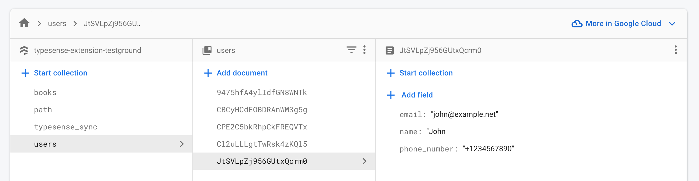
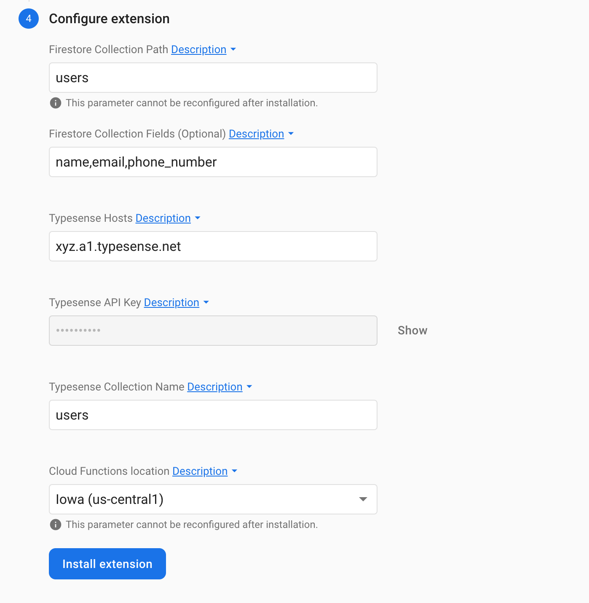

# Firestore / Firebase Typesense Search Extension ⚡ 🔍 

A Firebase extension to sync data from your Firestore collection to [Typesense](https://typesense.org/), 
to be able to do full-text fuzzy search on your Firestore data, with typo tolerance, faceting, filtering, sorting, curation, synonyms, geosearch and more.

This extension listens to your specified Firestore collection and syncs Firestore documents to Typesense 
on creation, updates and deletes. It also provides a function to help you backfill data.

**What is Typesense?**

If you're new to [Typesense](https://typesense.org), it is an open source search engine that is simple to use, run and scale, with clean APIs and documentation. Think of it as an open source alternative to Algolia and an easier-to-use, batteries-included alternative to ElasticSearch. Get a quick overview from [this guide](https://typesense.org/docs/guide).


## ⚙️ Usage

### Step 1️⃣ : Setup Prerequisites

Before installing this extension, make sure that you have:

1. [Set up a Cloud Firestore database](https://firebase.google.com/docs/firestore/quickstart) in your Firebase project.

   If using Google Workspace for Business, ensure that your default cloud compute based service account has the following roles (which can be found in the Google Cloud Console IAM section):
   
    * Artifact Registry Administrator
    * Artifact Registry Create-on-Push Writer
    * Artifact Registry Service Agent
    * Logs Writer
    * Storage Object Viewer
2. [Set up](https://typesense.org/docs/guide/install-typesense.html) a Typesense cluster on [Typesense Cloud](https://cloud.typesense.org) or [Self-Hosted](https://typesense.org/docs/guide/install-typesense.html#option-2-local-machine-self-hosting) (free).
3. Set up a Typesense Collection either through the Typesense Cloud dashboard or 
  through the [API](https://typesense.org/docs/latest/api/collections.html#create-a-collection).

> [!IMPORTANT]
> ☝️ #3 above is a commonly missed step. This extension **does not create the Typesense Collection for you**. Instead it syncs data to a Typesense collection you've already created. If you see an HTTP 404 in the extension logs, it's most likely because of missing this step. 

### Step 2️⃣ : Install the Extension 

You can install this extension either through the Firebase Web console or through the Firebase CLI.

##### Firebase Console

[][install-link]

[install-link]: https://console.firebase.google.com/project/_/extensions/install?ref=typesense/firestore-typesense-search

##### Firebase CLI

```bash
firebase ext:install typesense/firestore-typesense-search --project=[your-project-id]
```

Learn more about installing extensions in the Firebase Extensions documentation: [Console](https://firebase.google.com/docs/extensions/install-extensions?platform=console), [CLI](https://firebase.google.com/docs/extensions/install-extensions?platform=cli).

#### Syncing Multiple Firestore collections

One install can sync any number of Firestore collections, each into its own Typesense collection. List them in
`FIRESTORE_COLLECTION_PATHS` and `TYPESENSE_COLLECTION_NAMES` (same order), with optional per-collection settings in
`FIRESTORE_COLLECTION_FIELDS_LIST` and `FLATTEN_NESTED_DOCUMENTS_LIST`. Subcollection paths with placeholders such as
`users/{userId}/books` are supported; the placeholder values are added to each Typesense document.

#### Migrating from 3.x single-collection params

Version 4.0.0 removes the single-collection params `FIRESTORE_COLLECTION_PATH`, `TYPESENSE_COLLECTION_NAME`,
`FIRESTORE_COLLECTION_FIELDS` and `FLATTEN_NESTED_DOCUMENTS`. If you still use them, move each value to its list
counterpart. A single collection is a list of one, so the values do not change:

| Removed param                 | Replace with                       |
|-------------------------------|------------------------------------|
| `FIRESTORE_COLLECTION_PATH`   | `FIRESTORE_COLLECTION_PATHS`       |
| `TYPESENSE_COLLECTION_NAME`   | `TYPESENSE_COLLECTION_NAMES`       |
| `FIRESTORE_COLLECTION_FIELDS` | `FIRESTORE_COLLECTION_FIELDS_LIST` |
| `FLATTEN_NESTED_DOCUMENTS`    | `FLATTEN_NESTED_DOCUMENTS_LIST`    |

For example, this 3.x configuration:

```dotenv
FIRESTORE_COLLECTION_PATH=books
TYPESENSE_COLLECTION_NAME=books
FIRESTORE_COLLECTION_FIELDS=title,author
FLATTEN_NESTED_DOCUMENTS=false
```

becomes:

```dotenv
FIRESTORE_COLLECTION_PATHS=books
TYPESENSE_COLLECTION_NAMES=books
FIRESTORE_COLLECTION_FIELDS_LIST=title,author
FLATTEN_NESTED_DOCUMENTS_LIST=false
```

If the old params are still set and the new ones are empty, the functions fail on every write with an error that
prints the replacement lines for your values.

#### 🎛️ Configuration Parameters

When you install this extension, you'll be able to configure the following parameters:

| Parameter                           | Description                                                                                                                                                                                                                                                                                    |
|-------------------------------------|------------------------------------------------------------------------------------------------------------------------------------------------------------------------------------------------------------------------------------------------------------------------------------------------|
| Cloud Functions location            | Where do you want to deploy the functions created for this extension? You usually want a location close to your database. For help selecting a location, refer to the [location selection guide](https://firebase.google.com/docs/functions/locations).                                        |
| Firestore Database region           | Where the Firestore Database that holds the Firestore collection you want to sync into Typesense is located. Refer to the [Cloud Firestore locations guide](https://firebase.google.com/docs/firestore/locations).                                                                             |
| Firestore Collection Paths          | Comma-separated list of Firestore collection paths to index, e.g. `users,users/{userId}/books`. |
| Typesense Collection Names          | Comma-separated list of Typesense collection names, in the same order as the Firestore collection paths (you need to create these collections in Typesense yourself). |
| Firestore Collection Fields List    | Pipe-separated list of comma-separated field lists, one per collection, e.g. `name,email|title`. Leave a list empty to index all fields of that collection. |
| Flatten Nested Documents List       | Comma-separated list of `true`/`false`, one per collection. Set `true` for Typesense Server v0.23.1 and below, since indexing nested objects is natively supported only in v0.24 and above. |
| Typesense Hosts                     | A comma-separated list of Typesense Hosts (only domain without https or port number). For single node clusters, a single hostname is sufficient. For multi-node Highly Available or (Search Delivery Network) SDN Clusters, please be sure to mention all hostnames in a comma-separated list. | 
| Typesense API Key                   | A Typesense API key with admin permissions. Click on "Generate API Key" in cluster dashboard in Typesense Cloud.                                                                                                                                                                               |
| Log Typesense Inserts for Debugging | Should data inserted into Typesense be logged in Cloud Logging? This can be useful for debugging, but should not be enabled in production.                                                                                                                                                     |

> ⚠️ You'll notice that there is no way to configure the port number or protocol.
This is because this extension only supports connecting to Typesense running HTTPS on Port 443, since your data goes from Firebase to Typesense over the public internet and we want your data to be encrypted in transit.
For Typesense Cloud, HTTPS is already configured for you.
> 
> When self-hosting Typesense, you want to make sure you set `--api-port=443` and also get an SSL certificate from say [LetsEncrypt](https://letsencrypt.org/) or any registrar
and configure Typesense to use it using the `--ssl-certificate` and `--ssl-certificate-key` [server parameters](https://typesense.org/docs/latest/api/server-configuration.html).
> Alternatively, if you're running Typesense on your local machine, you can also set up a local HTTPS tunnel using something like [ngrok](https://ngrok.com/) (`ngrok http 8108`) and use the ngrok hostname in the extension. 

##### Example

If you have a Firestore database called `(default)` with a collection inside it called `users` in the `nam5` region like this:



Here's the extension configuration screen with all the options filled out, if you want to sync the `users` Firestore collection to Typesense:



### Step 3️⃣ : [Optional] Backfill existing data

This extension only syncs data that was created or changed in Firestore, after it was installed. In order to backfill data that already exists in your Firestore collection to your Typesense Collection:

- Create a new Firestore collection called `typesense_sync` through the Firestore UI.
- Create a new document with the ID `backfill` and contents of `{trigger: true}`
- [Optional] If you have [multiple instances](#syncing-multiple-firestore-collections) of the extension installed to sync multiple collections, you can specify which particular collections are backfilled by setting the contents of the `backfill` document in the previous step to `{trigger: true, firestore_collections: ["path/to/firestore_collection_1", "path/to/firestore_collection_2"] }`

This will trigger the backfill background Cloud function, which will read data from your Firestore collection(s) and create equivalent documents in your Typesense collection.

> [!NOTE]
> The `backfill` function is deployed with the Cloud Functions default timeout of 540 seconds (9 minutes). If you're backfilling a large collection (e.g. hundreds of thousands of documents or more) and the function times out before finishing, you can increase the timeout up to 3600 seconds (1 hour) from the Google Cloud Console by editing the `backfill` Cloud Run service and bumping the request timeout.

## ☁️ Cloud Functions

* **indexOnWrite:** A function that indexes data into Typesense when it's triggered by Firestore changes.

* **backfill:** A function that backfills data from a Firestore collection into Typesense, triggered when a Firestore document with the path `typesense_sync/backfill` has the contents of `trigger: true`.


## 🔑 Access Required

This extension will operate with the following project IAM roles:

* datastore.user (Reason: Required to backfill data from your Firestore collection into Typesense)

## 🧾 Billing

To install an extension, your project must be on the [Blaze (pay as you go) plan](https://firebase.google.com/pricing).

- You will be charged a small amount (typically around $0.01/month) for the Firebase resources required by this extension (even if it is not used).
- This extension uses other Firebase and Google Cloud Platform services, which have associated charges if you exceed the service’s free tier:
  - Cloud Firestore
  - Cloud Functions (Node.js 14+ runtime. [See FAQs](https://firebase.google.com/support/faq#expandable-24))
- Usage of this extension also requires you to have a running Typesense cluster either on Typesense Cloud or some
  self-hosted server. You are responsible for any associated costs with these services.


## Development Workflow

The functions are written in strict TypeScript (`functions/src`, compiled to `functions/lib`). The repo is a pnpm
workspace; dependencies younger than 7 days are refused (`minimumReleaseAge` in `pnpm-workspace.yaml`).

#### Setup

With Nix, `nix develop` provides Node 22, pnpm and Java (for the Firestore emulator). Otherwise install those yourself.
Docker is needed for the local Typesense server.

```shell
pnpm install
```

#### Checks

```shell
pnpm format        # oxfmt (pnpm format:check in CI)
pnpm typecheck     # tsc, strict
pnpm lint          # oxlint, type-aware
pnpm lint:guard    # rejects `any`, @ts-ignore/@ts-expect-error and lint-disable comments
```

#### Run Emulator

```shell
pnpm emulator
pnpm typesenseServer
```

- Emulator UI will be accessible at http://localhost:4000.
- Local Typesense server will be accessible at http://localhost:8108

Add records in the Firestore UI and they should be created in Typesense.

#### Run Tests

```shell
pnpm test:unit         # no emulator needed
pnpm test:integration  # builds, starts Typesense via docker compose if needed, runs each spec against the emulator
pnpm test              # both
```

#### Generate README

The Firebase CLI provides the following convenience command to auto-generate a README file containing content
pulled from extension.yaml file and PREINSTALL.md file:

```shell
firebase ext:info ./ --markdown > README.md
```

#### Publish Extension

- Update version number in extension.yaml
- Add entry to CHANGELOG.md
- Create release in GitHub
- 
    ```shell
    firebase ext:dev:upload typesense/firestore-typesense-search
    ```

## ℹ️ Support

Please read through the FAQ below, search through [past GitHub issues](https://github.com/search?q=repo%3Atypesense%2Ffirestore-typesense-search+repo%3Atypesense%2Ftypesense+firebase&type=issues), past threads in our [knowledge base](https://threads.typesense.org) and if you're unable to find an answer, please open a GitHub issue in this repo or join our [Slack community](https://join.slack.com/t/typesense-community/shared_invite/zt-2fetvh0pw-ft5y2YQlq4l_bPhhqpjXig) and ask there.

#### FAQs

- **My Typesense collection is empty, even after installing the extension. What could be wrong?**

   The extension only syncs changes from your Firestore collection _from the time when it is installed_. To backfill existing data from your Firestore collection into Typesense, you want to run the backfill step described [here](#step-3%EF%B8%8F⃣--optional-backfill-existing-data).

- **My Typesense collection is missing some records. What could be wrong?**

  This almost always is because the collection schema in Typesense does not match the structure of the documents in Firebase, and so Typesense is rejecting the documents due to validation failure.
  All validation errors returned by Typesense are logged in detail in the Firebase extension logs, which are accessible via the Firebase web console. You want to search the logs for both the backfill function and also the indexing function from this extension.

- **The backfill function is not getting triggered. What could be wrong?**

  The backfill function watches for changes to a document with ID called `backfill`, in a Firestore collection called `typesense_sync`. This document should have a key called `trigger` with a boolean value of `true`. So if you've already created this key, you want to change its value to `false` and then change it back to `true` to re-trigger the backfill function.

- **How do I sync multiple collections?**

  You can install this extension multiple times and set a different Firestore collection path for each instance. Read more [here](#syncing-multiple-firestore-collections)

- **How do I backfill just a single collection, when I've installed the extension multiple times?**

  See the last bullet point under the backfilling instructions [here](#step-3%EF%B8%8F⃣--optional-backfill-existing-data)
